# Adaptive-Headlights-Project

2026 Group 2 Senior Project for B.S. Mechanical Engineering Technology at ECPI

## About

This project is to design and implement a prototype of a headlight that can respond to dynammic input to adjust the beam height and direction. The dynamic input will simulate sensor inputs for ride height and steering angle.

### Objectives

- +/-15 degrees of horizontal movement
- +/- 5 degrees of vertical movement
- Maintain beam position while unpowered
- Fit within existing OEM housings
- Capable of manual adjustment

## Mechanical Design

The prototype uses a gimbal design with a 4-bar linkage to control horizontal movement and a wormgear drive for veritcal motion. Actuation is accomplished using 9g micro servos with 180 degrees of rotational movement. Dynamic input and motion control uses 10K potentiometers and an ATTiny85 microcontroller.

### CAD Assembly

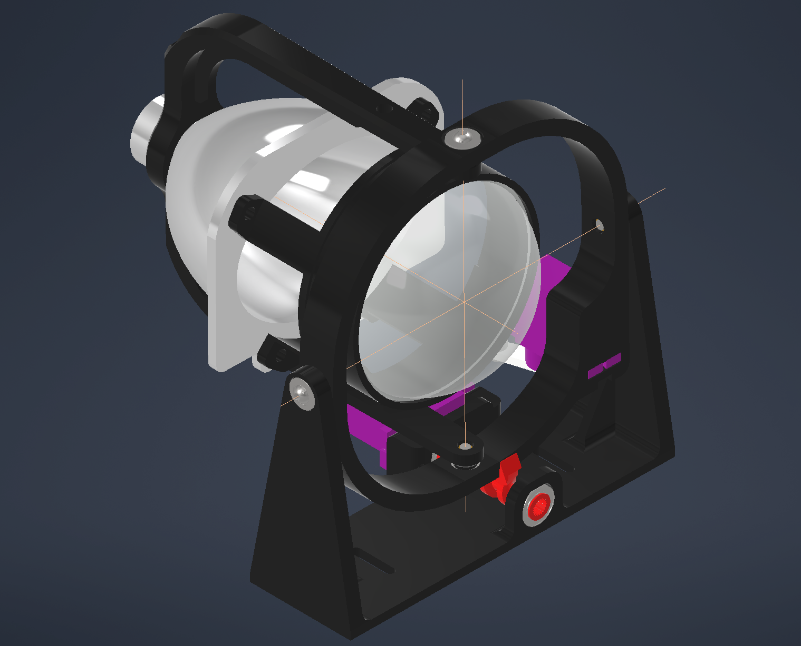
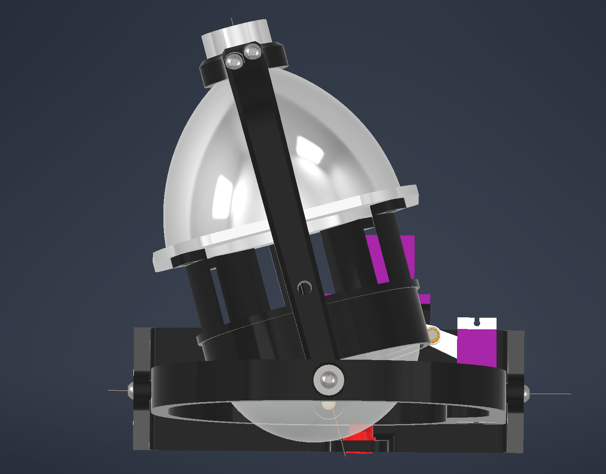
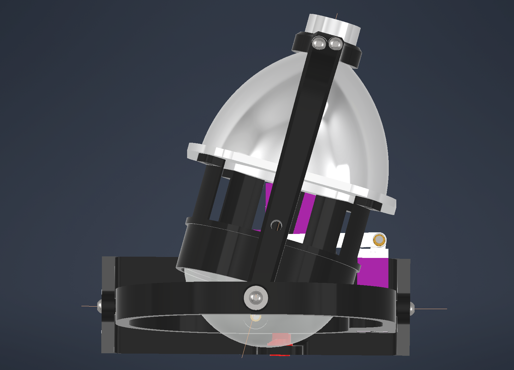
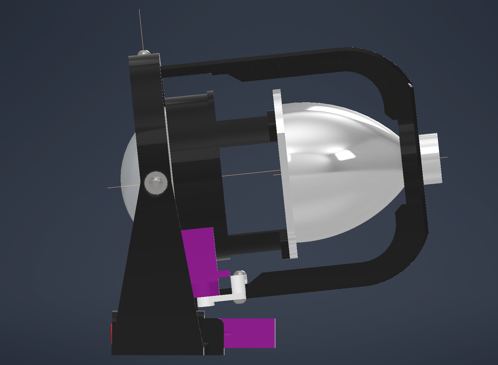
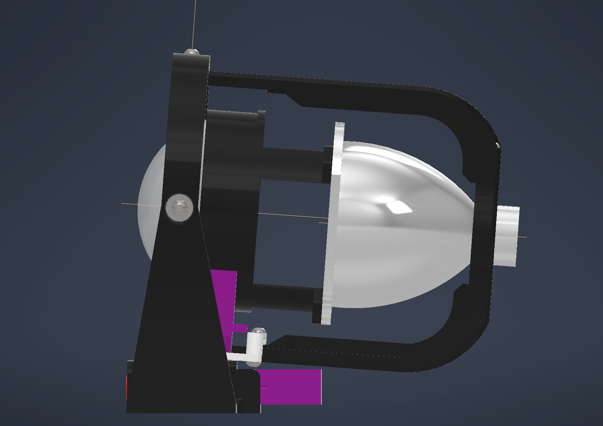

### CAD Drawings

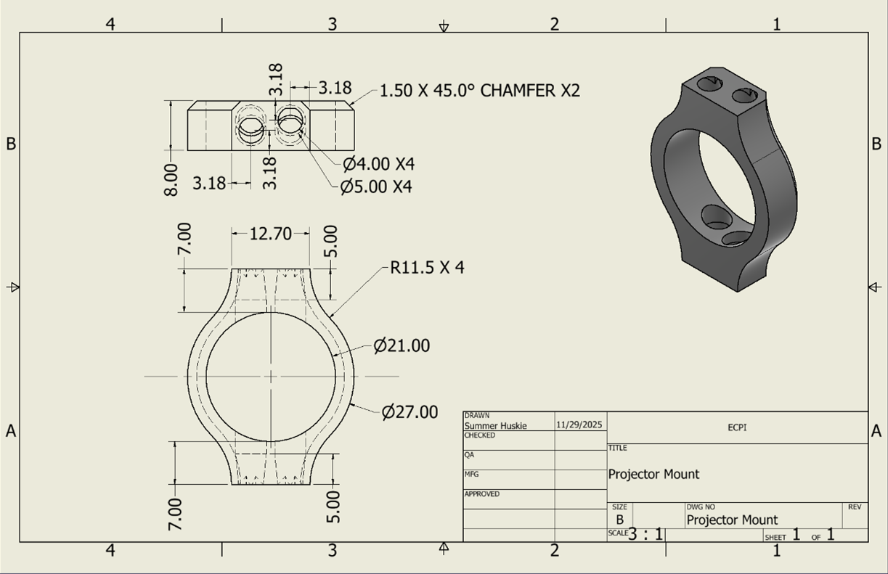

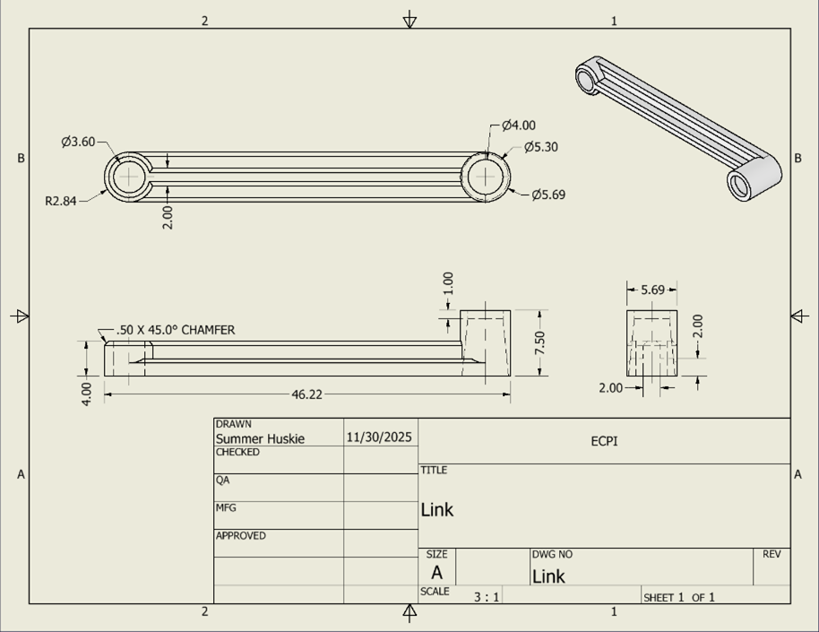
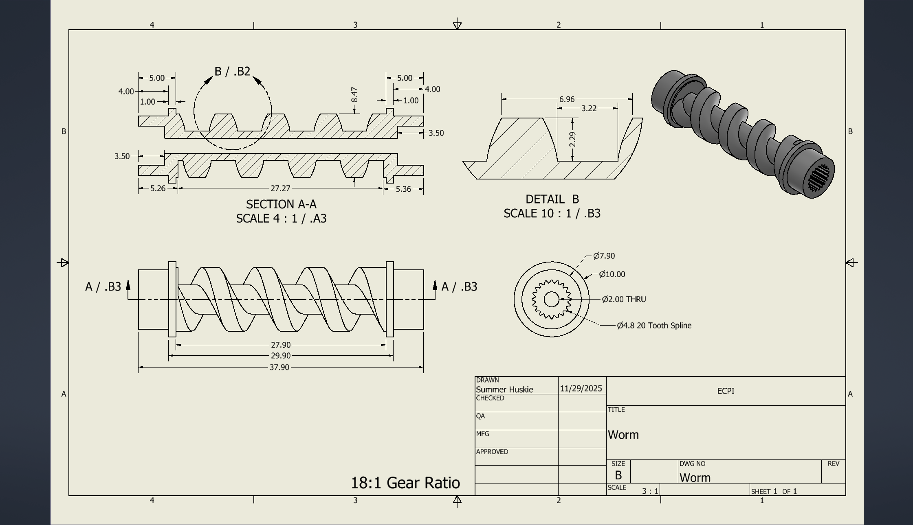

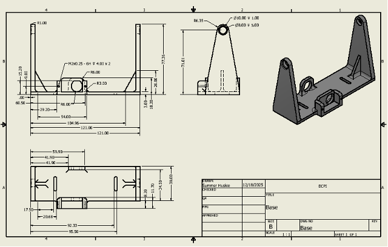

## Circuit Design

The circuit is simple to maintain focus on the mechanical aspects of the project. Design was done in TinkerCAD to allow for quick and easy feedback on the circuit and programming effectiveness.

## Prototype

Designed components were 3D printed using FDM carbon-fiber ASA for most parts and SLA ABS-like resin for the worm due to the complex geometry. Initial prints were instrumental in refining the design and tolerances.

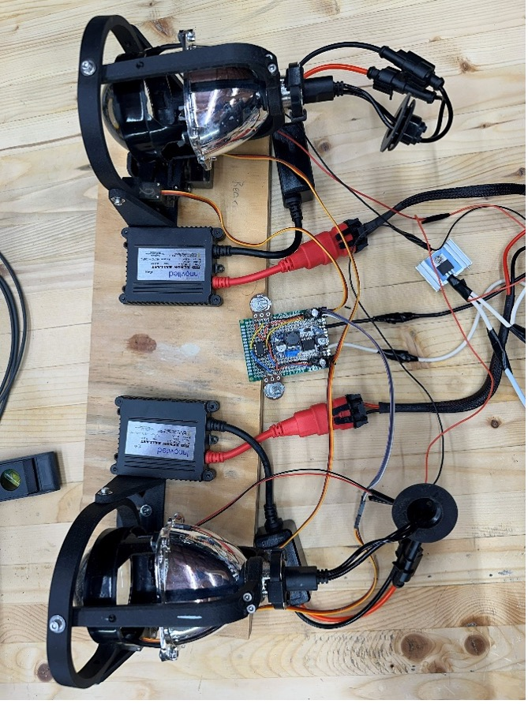
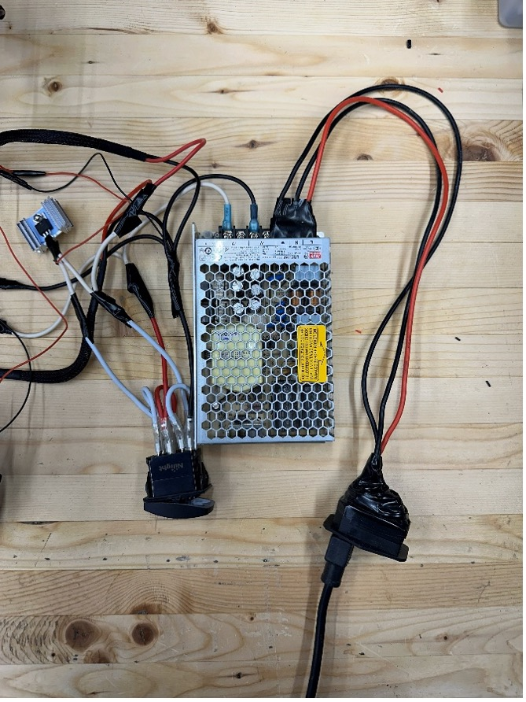
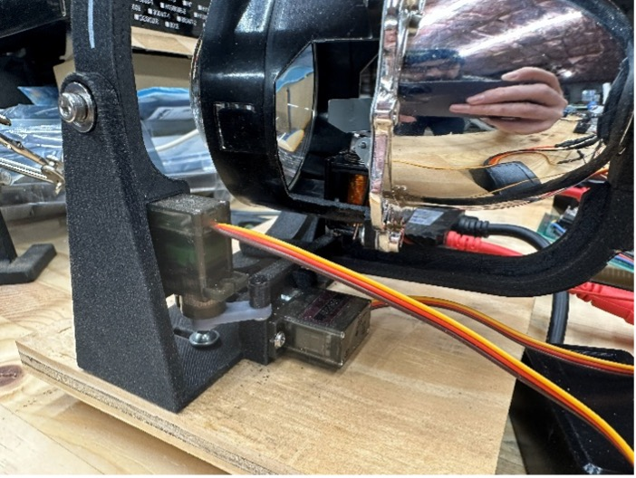
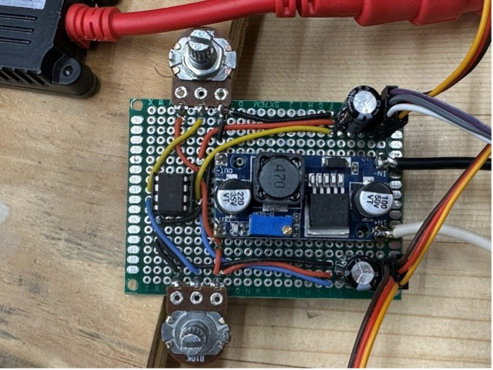
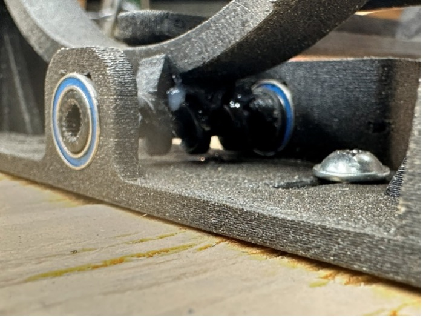
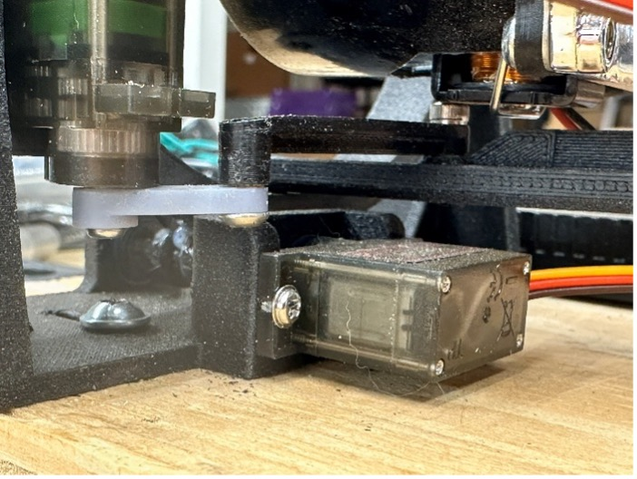

## Testing

Four tests were conducted to evaluate the functional performance, mechanical durability, and lighting effectiveness and verify that the project objectives were met.

Angles were calculated by measuring the distance from the beam center position to outer limit. 
Distance from wall: 20 feet (240 inches)

The formula is $θ=tan^(-1)⁡(y/x)$ where x is the distance from the wall and y is the distance the beam moved from center.

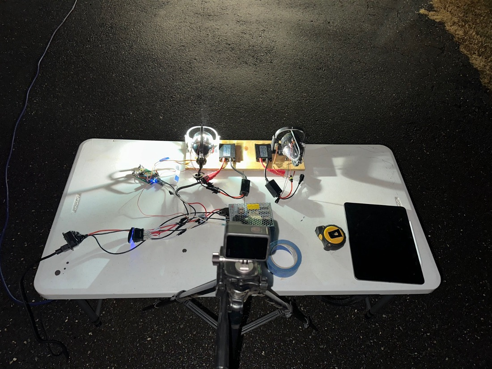

### Test 1 Range of Motion

This test will verify that the adaptive headlight system achieves the required horizontal and vertical beam adjustment ranges in response to steering angle and ride height sensor inputs.

#### Procedure

1. Secure the headlight prototype to a stable bench or vehicle mock-up facing a flat wall approximately 10 - 15 feet away.
2. Power on the adaptive headlight system and allow it to initialize.
3. Mark the straight-ahead, level beam position on the wall using masking tape (baseline reference).
4. Place a printed protractor or angle scale aligned with the headlight’s horizontal rotation axis to measure left/ right motion.
5. Attach a digital angle finder or digital level to the headlight frame to measure vertical tilt.

**Horizontal (Steering Input) Measurement:**

6. Set steering input to center (0°) and confirm beam alignment with baseline mark.
7. Apply maximum left steering input and record the horizontal beam angle.
8. Apply maximum right steering input and record the horizontal beam angle.

**Vertical (Ride Height Input) Measurement:**

9. Set ride height sensor to nominal (level-road) position and record vertical angle.
10. Simulate an uphill condition by adjusting the ride height sensor upward and record beam angle.
11. Simulate a downhill condition by adjusting the ride height sensor downward and record beam angle.
12. Return both inputs to neutral and verify the beam returns to the baseline position.

#### Pass/Fail Criteria

- Horizontal beam rotation reaches ± 15° (tolerance ± 2°) from center.
- Vertical beam adjustment reaches ± 5° (tolerance ± 1°) from nominal.
- Beam returns to baseline position when inputs are centered.
- Motion is smooth with no binding or unexpected coupling between axes.

#### Results

| Position | Measurement (inches) | Calculated Angle (degrees) |
|----------|----------------------|----------------------------|
| Left     | 55                   | 12.9                       |
| Right    | 53.5                 | 12.6                       |
| Down     | 5                    | 1.2                        |
| Up       | 4.75                 | 1.1                        |

All calculated angles failed to meet the range of motion objectives.

### Test 2 Static Load/Vibration Resistance

This test is to ensure the headlight maintains its position under minor vibrations and static loads similar to real vehicle conditions.

#### Procedure

1. Secure the headlight prototype in its normal mounting orientation.
2. Set the steering and ride height inputs to a non-neutral position.
3. Mark the beam position on a wall using masking tape.
4. Lightly tap the mounting structure or shake the test surface by hand for 10–15 seconds.
5. Observe any movement or drift in the beam position.
6. Repeat the test for different beam positions (center, extreme left/right, up/down).

#### Pass/Fail Criteria

- Beam position does not shift more than 1° after vibration.
- No audible gear skipping, rattling, or loosening of components.
- System maintains commanded position once disturbance stops.

#### Results

| Position | Change in Position (inches) | Distance from center (inches) | Calculated Angle (degrees) |
|----------|-----------------------------|-------------------------------|----------------------------|
| Center   | None                        | -                             | -                          |
| Left     | Down 0.5, Right 1.0         | 54                            | 12.7                       |
| Right    | Right 5.0                   | 54                            | 12.7                       |
| Down     | Down 0.25                   | 4.75                          | 1.1                        |
| Up       | Up 0.75                     | 5.5                           | 1.3                        |

Using the first test results as the baseline, this test passed with less than 1 degree of change in angle after manually vibrating the table.

### Test 3 Mechanical Durability/Repeatability

This test will evaluate the mechanical reliability of the servo-linkage and worm gear mechanisms under repeated operation.

#### Procedure

1. Mount the headlight prototype securely on a bench.
2. Power the system and verify normal operation.
3. Program or manually command the steering input to cycle from full left → center → full right → center.
4. Perform 20 consecutive steering cycles.
5. Observe and listen for unusual noises, binding, or increased resistance.
6. Repeat steps 3–5 for ride height adjustment (full up → center → full down → center).
7. After cycling, re-measure maximum left/right and up/down beam angles using a protractor or angle finder.

#### Pass/Fail Criteria

- No mechanical failure, excessive noise, or loss of motion during cycling.
- Final beam angles remain within ± 1° of pre-test measurements (baseline).
- No visible loosening of linkages, gears, or mounting points.

#### Results

| Position | Change in Position (inches) | Distance from center (inches) | Calculated Angle (degrees) |
|----------|-----------------------------|-------------------------------|----------------------------|
| Center   | None                        | -                             | -                          |
| Left     | Right 5.5                   | 60.5                          | 14.1                       |
| Right    | Right 5.0                   | 58.5                          | 13.7                       |
| Down     | None                        | -                             | -                          |
| Up       | None                        | -                             | -                          |

Using the first test results as the baseline, this test failed with more than 1 degree of change in angle in the horizontal axis.

### Test 4 LUX Intensity

This test will determine the amount of lux increase at the limits of the range of beam motion which will indicate a positive or negligible increase in visibility.

#### Test Procedure

1. Mount the headlight prototype securely on a flat work surface, such as a bench or table.
2. Position the bench at a distance from the flat wall such that the beam illuminates the center of the wall. Record the distance from the wall to the bench.
3. Power the system and verify normal operation.
4. Program or manually command the steering input to move the beam to the left, center, and right position, marking the center of the beam in each position with masking tape. 
5. Position the beam to the center position and measure the lux at each of the marked positions. 
6. Position the beam to the left position and measure the lux at each of the marked positions. 
7. Position the beam to the right position and measure the lux at each of the marked positions. 
8. Repeat the test at several intervals between the center and the left/right positions.

#### Pass/Fail Criteria

**Pass:** Measurements indicate that there is a positive increase in lux at the limits of the range of motion compared to a static beam.

**Fail:** Measurements indicate a marginal or no increase in lux at the limits of the range of motion compared to a static beam.

#### Results

| Position     | Left | Center-Left | Center | Center-Right| Right |
|--------------|------|-------------|--------|-------------|-------|
| Baseline LUX | 34.3 | -           | 196    | -           | 30.8  |
| Test LUX     | 78.1 | 42.1        | -      | 54.7        | 78.1  |

The results indicated an increase in LUX at points just past the range of horizontal motion.

## Conclusion

While the prototype failed to meet several of the stated objectives, it did validate that an adaptive or dynamic headlight has potential to effectively increase safety while driving at night. The failed objectives could be met with additional interations of the design and materials.
